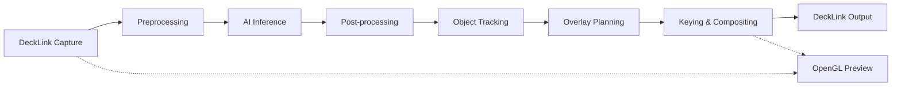

# DeepGI Box SDK - DeckLink Rust Integration


A comprehensive Rust SDK for Blackmagic DeckLink video capture and processing, designed for the DeepGI pipeline system with full Standard I/O packet compliance.

## 🎯 Overview

The DeepGI Box SDK provides a modular, high-performance video processing pipeline built around Blackmagic DeckLink hardware. It implements the DeepGI Standard I/O packet specification, enabling seamless integration of AI inference, object detection, tracking, and real-time overlay rendering for professional video workflows.

### Key Features

- **🎥 Professional Video I/O**: DeckLink capture and output with full format support
- **🤖 AI-Ready Pipeline**: Standard I/O packets designed for AI inference integration  
- **⚡ GPU Acceleration**: CUDA memory handoff for zero-copy processing
- **🔧 Modular Architecture**: Mix and match processing stages as needed
- **📊 Real-time Monitoring**: Comprehensive performance metrics and error tracking
- **🎨 OpenGL Preview**: Hardware-accelerated real-time preview
- **🔄 Thread-Safe Design**: Multi-threaded pipeline with proper synchronization

## 🏗️ Architecture



### Standard I/O Packet Flow

The pipeline follows a strict packet-based architecture:

```
RawFramePacket → TensorInputPacket → RawDetectionsPacket → DetectionsPacket → OverlayPlanPacket → KeyingPacket → Output
```

Each stage has well-defined input/output types, enabling type-safe composition and easy testing.

## 📦 Project Structure

```
DeepGiBox/
├── src/
│   ├── lib.rs              # Main library exports
│   ├── packets.rs          # Standard I/O packet definitions
│   ├── capture.rs          # DeckLink capture implementation
│   ├── preview.rs          # OpenGL preview functionality
│   ├── pipeline.rs         # Pipeline orchestration
│   ├── headless.rs         # Headless processing (Standard I/O)
│   └── bin/
│       ├── devicelist.rs       # List available DeckLink devices
│       ├── capture_preview_gl.rs # Full capture and preview demo
│       ├── pipeline_example.rs  # Basic pipeline demonstration
│       └── headless_test.rs     # Standard I/O pipeline testing
├── include/                # DeckLink SDK headers
├── shim/                   # C++ bridge for DeckLink API
├── PIPELINE_README.md      # Detailed pipeline documentation
├── HEADLESS_STANDARD_IO.md # Standard I/O implementation guide
└── stand_io_packet.md      # Packet format specification
```

## 🚀 Quick Start

### Prerequisites

- **Rust 1.70+**: Modern Rust toolchain
- **DeckLink Hardware**: Blackmagic DeckLink capture/output card
- **DeckLink Drivers**: Latest drivers from Blackmagic Design
- **DeckLink SDK**: Headers included in `include/` directory
- **OpenGL**: For preview functionality (Mesa, proprietary drivers)

### Installation

1. **Clone the repository**:
   ```bash
   git clone https://github.com/YAMAEARTH/DeepGiBox.git
   cd DeepGiBox
   ```

2. **Check DeckLink devices**:
   ```bash
   cargo run --bin devicelist
   ```

3. **Build all components**:
   ```bash
   cargo build --release
   ```

### Basic Usage Examples

#### 1. Device Discovery
```bash
cargo run --bin devicelist
# Output: 0: DeckLink SDI 4K
```

#### 2. Capture and Preview
```bash
cargo run --bin capture_preview_gl
```

#### 3. Standard I/O Pipeline Testing
```bash
cargo run --bin headless_test
```

#### 4. Basic Pipeline Integration
```rust
use decklink_rust::{
    HeadlessProcessor, HeadlessConfig, CaptureConfig, ColorSpace,
    PreprocessingConfig, InferenceConfig
};

// Configure AI inference pipeline
let config = HeadlessConfig {
    capture_config: CaptureConfig {
        device_index: 0,
        source_id: 100,
        expected_colorspace: ColorSpace::BT709,
    },
    preprocessing: Some(PreprocessingConfig {
        target_width: 640,
        target_height: 480,
        normalize: true,
    }),
    inference: Some(InferenceConfig {
        model_name: "yolov8n".to_string(),
        confidence_threshold: 0.5,
    }),
    max_runtime: Some(Duration::from_secs(30)),
    ..Default::default()
};

let mut processor = HeadlessProcessor::new(config);
processor.run()?;
```

## 📋 Standard I/O Packets

The SDK implements a comprehensive packet system for type-safe data flow:

### Core Packet Types

| Packet Type | Purpose | Input Stage | Output Stage |
|-------------|---------|-------------|--------------|
| `RawFramePacket` | Raw video frames | DeckLink Capture | Preprocessing |
| `TensorInputPacket` | AI-ready tensors | Preprocessing | Inference |
| `RawDetectionsPacket` | Model predictions | Inference | Post-processing |
| `DetectionsPacket` | Filtered detections | Post-processing | Tracking |
| `OverlayPlanPacket` | Rendering instructions | Overlay Planning | Keying |
| `KeyingPacket` | Final composite | Keying | Output |

### Memory Management

The packet system supports both CPU and GPU memory:

```rust
enum MemLoc {
    Cpu { ptr: *mut u8, size: usize },
    Cuda { device_ptr: u64 },
}
```

This enables zero-copy GPU processing for optimal performance.

## 🔧 Available Binaries

### `devicelist`
Lists all available DeckLink devices in the system.

**Usage:**
```bash
cargo run --bin devicelist
```

### `capture_preview_gl`
Full-featured capture and preview application with OpenGL rendering.

**Features:**
- Real-time video capture
- Hardware-accelerated preview
- Performance monitoring
- Multiple format support

**Usage:**
```bash
cargo run --bin capture_preview_gl
```

### `pipeline_example`
Demonstrates basic pipeline construction and custom processing stages.

**Usage:**
```bash
cargo run --bin pipeline_example
```

### `headless_test`
Comprehensive testing of the Standard I/O pipeline implementation.

**Test Configurations:**
1. **Capture Only** - Basic frame acquisition
2. **Preprocessing Pipeline** - Frame preparation workflow  
3. **AI Inference Pipeline** - Complete ML processing
4. **Full Pipeline** - All stages with tracking and overlay

**Usage:**
```bash
cargo run --bin headless_test
```

## 🧪 Testing & Validation

### Performance Testing
The headless test provides comprehensive performance metrics:

```
📊 Pipeline Status - Runtime: 10.2s, Frames: 306, FPS: 30.0

✅ preprocessing - Processed: 306, Success: 100.0%, Avg: 3.50ms, Throughput: 30.0 FPS
✅ inference - Processed: 306, Success: 99.3%, Avg: 18.20ms, Throughput: 29.8 FPS
✅ postprocessing - Processed: 304, Success: 100.0%, Avg: 4.50ms, Throughput: 29.8 FPS
✅ tracking - Processed: 304, Success: 99.7%, Avg: 6.00ms, Throughput: 29.7 FPS
✅ overlay - Processed: 303, Success: 100.0%, Avg: 3.50ms, Throughput: 29.7 FPS
✅ keying - Processed: 303, Success: 100.0%, Avg: 2.10ms, Throughput: 29.7 FPS
✅ output - Processed: 303, Success: 99.7%, Avg: 4.50ms, Throughput: 29.6 FPS
```

### Unit Testing
```bash
cargo test
```

### Format Validation
```bash
cargo fmt --check
cargo clippy -- -D warnings
```

## 🎨 Pipeline Configurations

### Minimal Capture
```rust
HeadlessConfig {
    capture_config: CaptureConfig::default(),
    // All processing stages disabled
    ..Default::default()
}
```

### AI Inference Pipeline
```rust
HeadlessConfig {
    preprocessing: Some(PreprocessingConfig { /* ... */ }),
    inference: Some(InferenceConfig { /* ... */ }),
    postprocessing: Some(PostProcessingConfig { /* ... */ }),
    ..Default::default()
}
```

### Complete Production Pipeline
```rust
HeadlessConfig {
    // All stages enabled
    preprocessing: Some(PreprocessingConfig { /* ... */ }),
    inference: Some(InferenceConfig { /* ... */ }),
    postprocessing: Some(PostProcessingConfig { /* ... */ }),
    tracking: Some(TrackingConfig { enabled: true }),
    overlay: Some(OverlayConfig { /* ... */ }),
    keying: Some(KeyingConfig { /* ... */ }),
    output: Some(OutputConfig { /* ... */ }),
    ..Default::default()
}
```

## 🔌 Hardware Support

### Supported DeckLink Cards
- DeckLink SDI 4K
- DeckLink Studio 4K
- DeckLink Mini Recorder/Monitor
- DeckLink Duo 2
- All professional DeckLink series

### Video Formats
- **Resolution**: SD, HD, UHD, 4K DCI
- **Frame Rates**: 23.98p, 24p, 25p, 29.97p, 30p, 50p, 59.94p, 60p
- **Pixel Formats**: BGRA8, NV12, P010, UYVY, YUYV, V210
- **Color Spaces**: BT.709, BT.2020, sRGB

### Performance Requirements
- **CPU**: Intel i7/AMD Ryzen 7 or better
- **RAM**: 16GB minimum, 32GB recommended
- **GPU**: NVIDIA RTX series for CUDA acceleration
- **Storage**: NVMe SSD for high bitrate recording

## 🛠️ Development

### Building from Source

1. **Install dependencies**:
   ```bash
   # Ubuntu/Debian
   sudo apt install build-essential cmake pkg-config
   sudo apt install libgl1-mesa-dev libx11-dev
   
   # CentOS/RHEL
   sudo yum groupinstall "Development Tools"
   sudo yum install mesa-libGL-devel libX11-devel
   ```

2. **Configure DeckLink SDK** (optional):
   ```bash
   export DECKLINK_SDK_DIR=/path/to/decklink-sdk
   ```

3. **Build**:
   ```bash
   cargo build --release
   ```

### Custom Processing Stages

Implement the `PipelineStage` trait for custom processing:

```rust
use decklink_rust::{PipelineStage, RawFramePacket, PipelineError};

pub struct CustomStage {
    // Your configuration
}

impl PipelineStage<RawFramePacket, RawFramePacket> for CustomStage {
    type Error = PipelineError;
    
    fn process(&mut self, input: RawFramePacket) -> Result<RawFramePacket, Self::Error> {
        // Your processing logic
        Ok(input)
    }
}
```

### Adding New Packet Types

1. Define the packet in `src/packets.rs`
2. Implement proper memory management
3. Add stage implementations
4. Update documentation

## 📚 Documentation

- **[PIPELINE_README.md](PIPELINE_README.md)** - Detailed pipeline architecture
- **[HEADLESS_STANDARD_IO.md](HEADLESS_STANDARD_IO.md)** - Standard I/O implementation
- **[stand_io_packet.md](stand_io_packet.md)** - Packet format specification
- **API Documentation**: `cargo doc --open`

## 🤝 Contributing

We welcome contributions! Please see our contribution guidelines:

1. **Fork the repository**
2. **Create a feature branch**: `git checkout -b feature/amazing-feature`
3. **Follow the standard packet format** for new stages
4. **Add comprehensive tests**
5. **Update documentation**
6. **Submit a pull request**

### Code Style
- Follow Rust conventions (`rustfmt`)
- Use `clippy` for linting
- Document public APIs
- Include unit tests

## 📄 License

This project is licensed under the MIT License - see the [LICENSE](LICENSE) file for details.

## 🙏 Acknowledgments

- **Blackmagic Design** for the DeckLink SDK
- **The Rust Community** for excellent crates and tools
- **YAMAEARTH** for the DeepGI pipeline architecture
- **Contributors** who have helped improve this project

## 🔧 System Requirements

### Minimum Requirements
- **OS**: Linux (Ubuntu 20.04+), macOS 10.15+, Windows 10
- **CPU**: Intel i5 or AMD Ryzen 5
- **RAM**: 8GB
- **GPU**: Any OpenGL 3.3+ compatible card

### Recommended Requirements
- **OS**: Ubuntu 22.04 LTS or macOS 12+
- **CPU**: Intel i7-12700K or AMD Ryzen 7 5800X
- **RAM**: 32GB DDR4-3200
- **GPU**: NVIDIA RTX 4070 or better (for CUDA acceleration)
- **Storage**: 1TB NVMe SSD

## 📞 Support

- **Issues**: [GitHub Issues](https://github.com/YAMAEARTH/DeepGiBox/issues)
- **Discussions**: [GitHub Discussions](https://github.com/YAMAEARTH/DeepGiBox/discussions)
- **Documentation**: Built-in Rust docs (`cargo doc --open`)

---

**DeepGI Box SDK** - Enabling the future of AI-powered video processing 🚀
